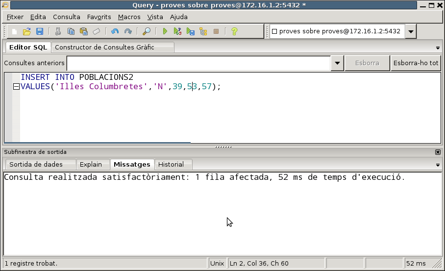

# 2. DDL

**DDL**(_Data Definition Language_) o **Llenguatge de Definició de Dades** és
el conjunt de sentències que ens permeten definir, retocar o esborrar
l'estructura de la Base de Dades. I com que l'estructura bàsica d'una Base de
Dades Relacional és la taula, ens dedicarem bàsicament a estudiar les
sentències que ens permeten definir les taules (o modificar-les o esborrar-
les), amb totes les restriccions que hem vist en el Model Relacional: clau
principal, claus externes, camps no nuls, ... També veurem altres objectes que
podrem definir, sobretot **vistes** , que es corresponen a l'esquema extern
que vam veure en el Tema 1, és a dir, la visió particular que pot tenir un
usuari.

Seran 3 sentències les que veurem:

  * **CREATE** , que permet crear un objecte nou.

  * **DROP** , que permet esborrar un objecte ja existent.

  * **ALTER** , que permet modificar un objecte ja existent.

En el moment de crear una taula definirem tots els seus camps, amb les
restriccions pertinents a cadascun d'ells. Cada camp haurà de ser d'un tipus
de dades. En cada SGBD hi ha uns tipus de dades particulars, encara que els
més bàsics són similars, i en ells serà on incidirem més.

## 2.1 Tipus de dades

En el moment de definir un camp haurem d'especificar obligatòriament de quin
tipus serà. Ja es van veure els tipus bàsics d'Access en el tutorial del tema
5. Ara els veurem els tipus bàsics de **PostgreSQL** , i veurem que hi haurà
molts tipus similars (com en tots els SGBD).

En el següent quadre es resumeixen els tipus de dades més importants de
PostgreSQL. És un conjunt molt extens, que fins i tot pot ampliar l'usuari amb
la instrucció **CREATE TYPE** , com veurem al final del tema. Són especialment
interessants els tipus geomètrics (amb **_POINT_** , **_BOX_** ,...) i el INET
(adreça IP).

  
També disposarem d'un tipus enumerat. El veurem en l'última pregunta del tema.

En la documentació de PostgreSQL trobarem tots els tipus possibles:   
><http://www.postgresql.org/docs/9.5/static/datatype.html>

## 2.2 CREATE TABLE

Permet crear una nova taula. Obligatòriament s'hauran d'especificar els camps
i els tipus de dades de cada camp. Òbviament, una vegada creada la taula
estarà buida, sense cap fila.

**<u>Sintaxi</u>**

    CREATE TABLE taula  
      ( camp1 tipus [(grandària)] [DEFAULT valor] [restricció11] [restricció12] [...]  
      [, camp2 tipus [(grandària)] [DEFAULT valor] [restricció21] [restricció22][...]  
      [, ...]]  
      [, restricciómultiple1 [, ...]] )

Podem observar que la definició de l'estructura de la taula va entre
parèntesis, separant per comes la definició de cada camp.

  * El nom de la taula no ha de ser el de cap altre objecte anterior (taula o vista). Si volem posar un nom amb més d'una paraula o amb una paraula reservada, l'haurem de posar entre cometes dobles; però no us ho aconselle, és preferible la utilització del guió baix, i així només és una paraula.

  * En cada camp posarem el seu nom i el tipus. Si el tipus de dades és VARCHAR, podrem posar opcionalment la grandària màxima (si no la posem serà de 255 en el cas de text). Si el tipus de dades és NUMERIC, podrem posar opcionalment la grandària (número de xifres significatives) i número de xifres de la part fraccionària.

  * Podem posar ocionalment un valor per defecte amb la clàusula **DEFAULT**. D'aquesta manera, en introduir una nova fila en la taula, si no li posem valor a aquest camp, agafarà el valor per defecte. En el valor es pot posar una constant del tipus del camp, o una expressió amb funcions, sempre que torne una dada dels tipus del camp.

  * Podem posar opcionalment restriccions a cada camp. Hauran d'anar abans de la coma que separa del següent camp. També poden haver restriccions que afecten a més d'un camp, que preferiblement posarem al final de la definició de la taula. Veurem les restriccions en el següent punt.

**<u>Exemples</u>**

Si voleu practicar aquestos exemples, feu-lo sobre la Base de Dades **proves**
(usuari **proves** , contrasenya **proves**). Si us dóna error perquè la taula
que aneu a crear ja està creada la taula, esborreu-la primer, i torneu a
executar la sentència.

  1) Crear una nova taula anomenada **EMPLEAT1** amb dos camps, un anomenat **dni** de tipus text i llargària 10 i un altre anomenat **nom****** amb llargària 50.

      CREATE TABLE EMPLEAT1 (dni VARCHAR (10) , nom VARCHAR (50));

  2) Crear una taula anomenada **EMPLEAT2** amb un camp text de 10 caràcters anomenat **dni** ; un altre camp de tipus text de llargària predeterminada (255) anomenat **nom;** un altre camp anomenat **data_naixement** de tipus data; un altre anomenat **sou** de tipus numèric, amb 6 xifres significatives, de les quals 2 ha de ser de la part fraccionària i un últim anomenat **departament** de tipus numèric menudet (INT2 o SMALLINT).

      CREATE TABLE EMPLEAT2  
            ( dni VARCHAR(10) ,  
            nom VARCHAR ,  
            data_naixement DATE ,  
            sou NUMERIC(6,2) ,  
            departament INT2 )

  3) Crear una taula anomenada **EMPLEAT3** com el de l'exemple anterior, però amb dos camps més al final: un camp anomenat **poblacio** de tipus text de 50 caràcters, i amb el valor per defecte **Castelló** i un últim anomenat **data_incorporacio** de tipus data i valor per defecte la data d'avui

      CREATE TABLE EMPLEAT3  
            ( dni VARCHAR(10) ,  
            nom VARCHAR ,  
            data_naixement DATE ,  
            sou NUMERIC(6,2) ,  
            departament INT2 ,  
            poblacio VARCHAR(50) DEFAULT 'Castelló' ,  
            data_incorporacio DATE DEFAULT CURRENT_DATE )

### :pencil2:Exercicis

Al llarg d'aquesta tercera part, en el conjunt d'exercicis de DDL, crearem
tota l'estructura de la Base de Dades **FACTURA** , però per a no interferir
cadascú amb els altres companys, cadascú es connectarà a la seua Base de Dades
**f_grup_9999x** (on grup és el vostre grup p.ex. 1cfsg, 1cfsh... , 9999 són
les 4 últimes xifres del vostre DNI, i x la lletra del NIF).

L'esquema Entitat-Relació i l'esquema relacional que implementarem serà el
següent:

En la Base de Dades anomenada **f_grup_9999x** (on grup és el vostre grup,
9999 són les 4 últimes xifres del vostre DNI, i x la lletra del NIF),
connectant com un usuari amb el mateix nom i contrasenya:

> **Ex_1** - Creeu la taula **CATEGORIA** , amb els mateixos camps i del mateix
> tipus que en la taula CATEGORIA de **FACTURA** , però de moment sense clau
> principal ni cap altra restricció.
>
> **Ex_2** - Creeu la taula **ARTICLE** , també sense restriccions. 

!!!note "Nota"
    Durant tots aquestos exercicis de DDL pot ser molt convenient tenir obertes
    les dues connexions: la de **FACTURA** (per anar consultant) i la de
    **f_grup_9999x** (per anar creant i modificant), on grup és el vostre grup,
    9999 són les 4 últimes xifres del vostre DNI, i x la lletra del NIF.

### 2.2.1 Restriccions (Constraint)

Per mig de les restriccions podrem definir dins d'una taula restriccions
d'usuari com són la definició de la clau principal, claus externes, camps no
nuls i camps únics.

Hi ha dues maneres de definir restriccions: les que afecten a un únic camp (i
que es posen en la mateixa definició del camp) i les que afecten o poden
afectar a més d'un camp, que s'han de definir separadament de la definició
dels camps. Comencem per les primeres, per ser més senzilles d'entendre:

#### 2.2.1.1 Restriccions de camp únic

Són restriccions que es posen en la mateixa definició del camp i només
afectaran a aquest camp: van per tant després del tipus de dades del camp i
abans de la coma de separació dels camps.

**<u>Sintaxi</u>**

      [ CONSTRAINT nom ] {PRIMARY KEY | UNIQUE | NOT NULL | REFERENCES taula2 [(camp1)] | CHECK (_condició_)}

Si no posem nom a la restricció (CONSTRAINT nom) PostgreSQL li assignarà
automàticament un nom. Açò pot resultar còmode en ocasions, per a no haver
d'inventar-nos noms per a les restriccions, però després ens limitaria a que
no podríem retocar aquestes restriccions.

Els tipus de restriccions que podem definir són:

**Restricció de clau principal**{.azul}

  * **PRIMARY KEY** : el camp serà clau principal.

> Per exemple, d'aquesta manera definirem la taula EMPLEAT3 (com la de
> l'apartat anterior) amb el camp dni com a clau principal. Recordeu que l'heu
> d'esborrar primer (potser no l'estigueu visualitzant en pgAdmin, però sí que
> està creada; refresqueu constantment les taules per saber la situació
> actual)

      CREATE TABLE EMPLEAT3  
            ( dni VARCHAR(10) CONSTRAINT cp_emp3 PRIMARY KEY,  
            nom VARCHAR ,  
            data_naixement DATE ,  
            sou NUMERIC(6,2) ,  
            departament INT2 ,  
            poblacio VARCHAR(50) DEFAULT 'Castelló' ,  
            data_incorporacio DATE DEFAULT CURRENT_DATE )

!!!Note "Nota"
    Podeu comprovar que si no poseu nom a la restrició, és a dir si poseu
    directament dni **TEXT(10) PRIMARY KEY**, i aneu al disseny de la taula,
    PostgreSQL posa automàticament un nom a la restricció format pel nom de la taula seguit de **_pkey**.

>> Tingueu en compte també que si la taula ja existia donarà un error. Només
heu d'esborrar-la primer.

**Restricció d'unicitat**{.azul}

  * **UNIQUE** : el camp serà únic, és a dir, no es podrà agafar dues vegades el mateix valor en aquest camp (_Indexat sense duplicats_ en Access). PostgreSQL generarà automàticament un índex per a aquest camp. Veurem què és un índex en la pregunta 6.

> Per exemple, d'aquesta manera definiríem la taula EMPLEAT3 amb la restricció
> que el camp **nom** no es pot repetir (si voleu provar la sentència feu-lo
> en la BD **proves** , i si ja existeix l'esborreu primer):

      CREATE TABLE EMPLEAT3  
            ( dni VARCHAR(10) ,  
            nom VARCHAR CONSTRAINT u_nom UNIQUE,  
            data_naixement DATE ,  
            sou NUMERIC(6,2) ,  
            departament INT2 ,  
            poblacio VARCHAR(50) DEFAULT 'Castelló' ,  
            data_incorporacio DATE DEFAULT CURRENT_DATE )

**Restricció de valor no nul**{.azul}

  * **NOT NULL** : el camp no podrà agafar un valor nul (_Requerido_ en Access). Hem de ser conscients que no val la pena definir com a no nula la clau principal, ja que per definició ja ho és.

> Per exemple, d'aquesta manera definirem que el camp **nom** ha de ser no
> nul.

      CREATE TABLE EMPLEAT3  
            ( dni VARCHAR(10) ,  
            nom VARCHAR CONSTRAINT nn_nom NOT NULL ,  
            data_naixement DATE ,  
            sou NUMERIC(6,2) ,  
            departament INT2 ,  
            poblacio VARCHAR(50) DEFAULT 'Castelló' ,  
            data_incorporacio DATE DEFAULT CURRENT_DATE )

**Restricció d'integritat referencial**{.azul}

  * **REFERENCES** : servirà per a definir que aquest camp és una clau externa. Haurem d'especificar obligatòriament la taula a la qual apunta, i opcionalment podem posar entre parèntesis el camp de la taula al qual apunta, encara que si no ho posem, per defecte apuntarà a la clau principal (i nosaltres sempre voldrem apuntar a la clau principal).

> Per exemple, d'aquesta manera podem definir la clau externa que apunta a la
> taula DEPARTAMENT (i que indica que l'empleat pertany al departament). Abans
> de crear aquesta versió de EMPLEAT3, hem de tenir creada la taula
> DEPARTAMENT, sinó donarà error:

      CREATE TABLE DEPARTAMENT  
            ( num_d INT2 CONSTRAINT cp_dep PRIMARY KEY ,  
            nom_d VARCHAR(50) ,  
            director VARCHAR(10) ,  
            data DATE );

      CREATE TABLE EMPLEAT3  
            ( dni VARCHAR(10) ,  
            nom VARCHAR ,  
            data_naixement DATE ,  
            sou NUMERIC(6,2) ,  
            departament INT2 CONSTRAINT ce_emp3_dep REFERENCES DEPARTAMENT ,  
            poblacio VARCHAR(50) DEFAULT 'Castelló' ,  
            data_incorporacio DATE DEFAULT CURRENT_DATE );

> Com ja es va veure en el tema del Model Relacional (restriccions d'integritat referencial), hi ha 3 maneres d'actuar quan s'esborra o es modifica una fila de la taula
> principal que té associades files en la taula relacionada per mig de la clau
> externa. Per exemple, què fem amb els familiars d'un empleat si esborrem
> l'empleat? Aquestes maneres d'actuar s'han d'especificar en el moment de
> definir la clau externa. La manera de posar-les en SQL i el significat són
> les següents:
>
  - **NO ACTION** : no es deixarà esborrar o modificar de la taula
> principal si en té alguna fila relacionada. És l'opció per defecte. Així en
> l'exemple d'EMPLEAT3, amb una clau externa que apunta a DEPARTAMENT, si
> intentem esborrar o modificar el numero d'un departament que té empleats,
> ens donarà un missatge d'error, avisant que com té registres relacionats en
> una altra taula no es pot esborrar o modificar.
>

>  - **CASCADE** : s'esborraran (o modificaran) en cascada els registres
> relacionats de la taula on està la clau externa. S'especificarà amb **ON
> DELETE CASCADE** o **ON UPDATE CASCADE**.

      CREATE TABLE EMPLEAT3  
            ( dni VARCHAR(10) ,  
            nom VARCHAR ,  
            data_naixement DATE ,  
            sou NUMERIC(6,2) ,  
            departament INT2 CONSTRAINT ce_emp3_dep REFERENCES DEPARTAMENT ON DELETE
            CASCADE ON UPDATE CASCADE ,  
            poblacio VARCHAR(50) DEFAULT 'Castelló' ,  
            data_incorporacio DATE DEFAULT CURRENT_DATE )
>
> D'aquesta manera si esborrem un departament de la taula DEPARTAMENT,
> s'esborraran també els empleats de la taula EMPLEATS3 d'aquest departament.
> I si en la taula DEPARTAMENT modifiquem un número de departament, per
> exemple de 5 a 50, aquest valor serà el nou valor en el camp departament de
> la taula EMPLEAT3 per a aquells que abans teníen un 5.
>

>   - **SET NULL** : posarà a nul el camp que és clau externa dels registres
> que estiguen relacionats amb l'esborrat o modificat de la taula principal.
> Així, si férem la següent definició de la taula EMPLEAT3

        CREATE TABLE EMPLEAT3  
            ( dni VARCHAR(10) ,  
            nom VARCHAR ,  
            data_naixement DATE ,  
            sou NUMERIC(6,2) ,  
            departament INT2 CONSTRAINT ce_emp3_dep REFERENCES DEPARTAMENT ON DELETE
            SET NULL ,  
            poblacio VARCHAR(50) DEFAULT 'Castelló' ,  
            data_incorporacio DATE DEFAULT CURRENT_DATE )
>
> en el cas que esborrem el departament 5, no donaria cap error per aquesta
> restricció d'integritat, i posaria a nul el departament d'aquells empleats
> que abans eren del departament 5.
>

   >-  **SET DEFAULT**: Estableix les columnes que referencien als seus valors per defecte. Ha d'existir una fila en la taula referenicada que coincidixca amb els valors per defecte, si no són NULL, o l'opració fallarà.

**Restricció externa**{.azul}

  * **CHECK** : farà una comprovació per a validar els valors introduïts per a aquest camp. La condició de validació ha d'anar entre parèntesis, i ha de ser una expressió, normalment de comparació del camp en qüestió amb algun valor.

Per exemple, anem a exigir que el sou siga estrictament positiu (per tipus de
dades numèric, podria agafar el valor 0 o valors negatius)

      CREATE TABLE EMPLEAT3  
            ( dni VARCHAR(10) ,  
            nom VARCHAR ,  
            data_naixement DATE ,  
            sou NUMERIC(6,2) CONSTRAINT sou_positiu CHECK (sou > 0),  
            departament INT2 ,  
            poblacio VARCHAR(50) DEFAULT 'Castelló' ,  
            data_incorporacio DATE DEFAULT CURRENT_DATE )

Evidentment es pot posar més d'una restricció en la definició d'una taula. En
aquest exemple arrepleguem totes les anteriors, és a dir, definim la taula
**EMPLEAT3** amb tots els seus camps, i definint la _clau principal_
(**dni**), amb el camp **nom** _únic_ , amb el **sou** _estrictament positiu_, i amb el camp **departament** que serà _clau externa_ que apunta a la taula
DEPARTAMENT. Per complicar-lo un poc més també exigirem que el camp **nom**
siga _no nul_, i així veure que es pot posar més d'una restricció en un camp.

    CREATE TABLE EMPLEAT3  
            ( dni VARCHAR(10) CONSTRAINT cp_emp3 PRIMARY KEY ,  
            nom VARCHAR CONSTRAINT u_nom UNIQUE CONSTRAINT nn_nom NOT NULL ,  
            data_naixement DATE ,  
            sou NUMERIC(6,2) CONSTRAINT sou_positiu CHECK (sou > 0) ,  
            departament INT2 CONSTRAINT ce_emp3_dep REFERENCES DEPARTAMENT ,  
            poblacio VARCHAR(50) DEFAULT 'Castelló' ,  
            data_incorporacio DATE DEFAULT CURRENT_DATE )

Observeu que com a qüestió d'estil s'han posat noms a les restriccions que
d'alguna manera suggereixen el motiu de la restricció. Així, **cp_emp3** vol
dir _clau princpal de EMPLEAT3_ , **u_nom** vol dir que el camp _nom_ és
_únic_ , **nn_nom** vol dir que _nom_ és _no nul_ , **nn_sou** vol dir que
_sou_ és _no nul_ , i **ce_emp3_dep** vol dir _clau externa de la taula
EMPLEAT3 a la taula DEPARTAMENT_. Si tenim un criteri clar per als noms de les
restriccions, si després les volem desactivar temporalment o senzillament
esborrar-les, ho podrem fer des de SQL.

#### 2.2.1.2 Restriccions de camp múltiple

També s'anomenen restriccions de taula, en contraposició a les anteriors, que
són restriccions de camp. Són restriccions que van dins de la definició d'una
taula però fora de la definició d'un camp, i que poden afectar a un o més d'un
camp. S'haurà de definir expressament a quin o quins camps afecten.

**<u>Sintaxi</u>**

      [ CONSTRAINT nom ] {PRIMARY KEY | UNIQUE | FOREIGN KEY | CHECK (_condicio_)} (c11 [,c12][,...])   
      [ REFERENCES taula2 [ (c21 [,c22][,...]) ] ]  
      [ ON DELETE {CASCADE | SET NULL}] [ON UPDATE {CASCADE | SET NULL}] ]

Igual que abans, si no posem nom a la restricció (CONSTRAINT nom) PostgreSQL
li n'assignarà un automàticament, que serà construït de manera molt lògica.

Observeu que ara sempre especifiquem el o els camps afectats.

Els tipus de restriccions són els mateixos que en el cas anterior, però la
sintaxi variarà lleugerament:

**Restricció de clau principal**{.azul}

  * **PRIMARY KEY** : posarem entre parèntesis el camp o camps (en aquest cas separats per comes) que seran clau principal.

> Per exemple, definim una altra vegada el camp dni com a clau principal de la
> taula EMPLEAT3

      CREATE TABLE EMPLEAT3  
            ( dni VARCHAR(10) ,  
            nom VARCHAR ,  
            data_naixement DATE ,  
            sou NUMERIC(6,2) ,  
            departament INT2 ,  
            poblacio VARCHAR(50) DEFAULT 'Castelló' ,  
            data_incorporacio DATE DEFAULT CURRENT_DATE ,  
            CONSTRAINT cp_emp3 PRIMARY KEY (dni) )

> I ara un altre per a definir la clau principal de FAMILIAR. Com la clau està
> formada per 2 camps, estem obligats a utilitzar una restricció de camp
> múltiple.

      CREATE TABLE FAMILIAR  
            ( dni VARCHAR(10),  
            nom VARCHAR,  
            data_n DATE,  
            parentesc VARCHAR(50),  
            CONSTRAINT cp_fam2 PRIMARY KEY (dni,nom) )

> Com comentàvem, si la clau principal està formada per 2 camps estarem
> obligats a utilitzar una restricció de camp múltiple. Un **error**{.rojo} prou comú
> seria el següent:

      CREATE TABLE FAMILIAR2
            ( dni VARCHAR(10) PRIMARY KEY,
            nom VARCHAR PRIMARY KEY,
            data_n DATE,
            parentesc VARCHAR(50) )

> Podeu comprovar que donarà **error**{.rojo} , perquè estem intentant definir 2
> claus principals. La clau principal és única, això sí formada per 2 camps en
> aquesta ocasió.

**Restricció d'unicitat**{.azul}

  * **UNIQUE** : ara posarem entre parèntesis el o els camps que seran únics (en el seu conjunt). PostgreSQL generarà automàticament un índex per a aquesta combinació de camps. Veurem què és un índex en la pregunta 6.

> Per exemple, modifiquem la definició de EMPLEAT3 (anomenant-la EMPLEAT4) ,
> amb un camp per als **cognoms** i un camp per al **nom**. Definirem la
> restricció que els camps cognoms i nom (en conjunt) no es poden repetir.

      CREATE TABLE EMPLEAT4  
            ( dni VARCHAR(10),  
            cognoms VARCHAR,  
            nom VARCHAR,  
            data_naixement DATE,  
            sou NUMERIC(6,2) ,  
            departament INT2 ,  
            CONSTRAINT u_nom4 UNIQUE (cognoms,nom) )

**Restricció de valor no nul**{.azul}

  * **NOT NULL**.

> No existeix aquesta opció com a restricció múltiple. Per tant s'ha de
> definir sempre com a restricció de camp únic.

**Restricció d'integritat referencial**{.azul}

  * **FOREIGN KEY** : servirà per a definir que aquest o aquestos camps són una clau externa. És la que més varia en la seua sintaxi, ja que hem d'especificar tant el o els camps d'aquesta taula que són clau externa, com la taula a la qual apunta (i en tot cas el o els camps on s'apunta, encara que si no ho posem apuntarà a la clau principal de l'altra taula, cosa que voldrem sempre):

        [CONSTRAINT nom] FOREIGN KEY (c11 [,c12][,...]) REFERENCES taula2 [(c21 [,c22][,...])] [ON DELETE {CASCADE | SET NULL}] [ON UPDATE {CASCADE | SET NULL}]

> En l'exemple de la clau externa que apunta a la taula DEPARTAMENT quedarà
> així:

      CREATE TABLE EMPLEAT3  
            ( dni VARCHAR(10) ,  
            nom VARCHAR ,  
            data_naixement DATE ,  
            sou NUMERIC(6,2) ,  
            departament INT2 ,  
            poblacio VARCHAR(50) DEFAULT 'Castelló' ,  
            data_incorporacio DATE DEFAULT CURRENT_DATE ,  
            CONSTRAINT ce_emp3_dep FOREIGN KEY (departament) REFERENCES DEPARTAMENT )

**Restricció externa**{.azul}

  * **CHECK** : ara la condició de validació podrà afectar a més d'un camp

Per exemple podríem exigir que la data d'incorporació siga estrictament
posterior a la data de naixement

      CREATE TABLE EMPLEAT3  
            ( dni VARCHAR(10) ,  
            nom VARCHAR ,  
            data_naixement DATE ,  
            sou NUMERIC(6,2) ,  
            departament INT2 ,  
            poblacio VARCHAR(50) DEFAULT 'Castelló' ,  
            data_incorporacio DATE DEFAULT CURRENT_DATE ,  
            CONSTRAINT check_dates CHECK (data_incorporacio > data_naixement) )

O una altra una miqueta més real, anem a agafar empleats de més de 18 anys, i
per tant anem a exigir que la data d'incorporació siga més de 18 anys
posterior a la data de naixement. Per a això utilitzem la funció
**AGE(f1,f2)** que calcula el temps entre la data d2 i la data d1 (que ha de
ser la posterior), i d'ahí extraurem els anys amb **EXTRACT(year FROM ...)**

      CREATE TABLE EMPLEAT3  
            ( dni VARCHAR(10) ,  
            nom VARCHAR ,  
            data_naixement DATE ,  
            sou NUMERIC(6,2) ,  
            departament INT2 ,  
            poblacio VARCHAR(50) DEFAULT 'Castelló' ,  
            data_incorporacio DATE DEFAULT CURRENT_DATE ,  
            CONSTRAINT check_dates  
            CHECK (EXTRACT(year FROM AGE(data_incorporacio,data_naixement) ) >=18 ) )

Evidentment, es poden barrejar les restriccions de camp únic i les de camp
múltiple. Ací en tenim un exemple on s'arrepleguen moltes (no totes) les
restriccions anteriors. Hem posat de camp múltiple la dels 18 anys dels
empleats, perquè no hi ha un altre remei, i també la de no repetició del camp
**nom** , encara que podia ser de camp únic:

    CREATE TABLE EMPLEAT3  
            ( dni VARCHAR(10) CONSTRAINT cp_emp3 PRIMARY KEY ,  
            nom VARCHAR CONSTRAINT nn_nom NOT NULL ,  
            data_naixement DATE ,  
            sou NUMERIC(6,2) CONSTRAINT sou_positiu CHECK (sou > 0) ,  
            departament INT2 CONSTRAINT ce_emp3_dep REFERENCES DEPARTAMENT ,  
            poblacio VARCHAR(50) DEFAULT 'Castelló' ,  
            data_incorporacio DATE DEFAULT CURRENT_DATE ,  
            CONSTRAINT u_nom3 UNIQUE (nom) ,  
            CONSTRAINT check_dates  
            CHECK (EXTRACT(year FROM AGE(data_incorporacio,data_naixement) ) >=18 ) )

### :pencil2: Exercicis

En **f_grup_9999x** (on grup és el vostre grup, 9999 són les 4 últimes xifres
del vostre DNI, i x la lletra del NIF)

> **Ex_3** - Crear la taula **PROVINCIA** , amb la clau principal.
>
> **Ex_4** - Crear la taula **POBLE** , amb la clau principal i la restricció
> que el camp **cod_pro** és clau externa que apunta a PROVINCIA.
>
> **Ex_5** - Crear la taula **VENEDOR** , amb la clau principal i la clau
> externa a POBLE (de moment no definim la clau externa a VENEDOR, que és
> reflexiva).
>
> **Ex_6** - Crear la taula **CLIENT** , amb la clau principal i la clau externa
> a POBLE
>
> **Ex_7** - Crear la taula **FACTURA** , amb la clau principal i les claus
> externes a CLIENT i VENEDOR. També heu d'exigir que **cod_cli** siga no nul.
>
> **Ex_8** - Crear la taula **LINIA_FAC** , amb la clau principal (observa que
> està formada per 2 camps) però de moment sense la clau externa que apunta a
> ARTICLE. A més **cod_a** ha de ser no nul.

## 2.3 ALTER TABLE

Permet modificar l'estructura d'una taula ja existent, bé afegint, llevant o
modificant camps (columnes), bé afegint o llevant restriccions. També servirà
per a canviar el nom d'un camp i fins i tot canviar el nom de la taula

**<u>Sintaxi</u>**

Per a alterar l'estructura d'algun camp o restricció utilitzarem aquesta
sintaxi:

      ALTER TABLE taula  
            {ADD | DROP | ALTER} {COLUMN camp | CONSTRAINT restricció múltiple}

Per a canviar el nom d'un camp:

      ALTER TABLE taula  
            RENAME [COLUMN] camp TO nou_nom_camp

Per a canviar el nom de la taula:

    ALTER TABLE taula  
      RENAME TO nou_nom_taula

**Afegir camp o restricció**{.azul}

Si volem afegir una columna o una restricció, l'haurem de definir totalment.

  * En el cas d'un camp, haurem d'especificar el nom, el tipus i opcionalment una restricció que afecte només al camp. Per exemple, aquesta sentència afegeix el camp supervisor (de tipus text de 10) a la taula EMPLEAT3. Observeu que en la definició del camp poden entrar restriccions de camp únic.

        ALTER TABLE EMPLEAT3  
            ADD COLUMN supervisor VARCHAR(10)

  * En el cas d'una restricció, aquesta serà del tipus de restricció múltiple, amb la sintaxi que vam veure en l'apartat de restriccions. Per exemple, aquesta sentència afegeix la clau externa reflexiva (de EMPLEAT3 a EMPLEAT3) que indica els supervisors. El dni hauria de ser la clau principal de EMPLEAT3

        ALTER TABLE EMPLEAT3  
            ADD CONSTRAINT ce_emp3_emp3 FOREIGN KEY (supervisor) REFERENCES EMPLEAT3 (dni)

**Modificar un camp**{.azul}

Podem fer dues coses: modificar el tipus del camp o modificar el valor per
defecte (posar valor per defecte o llevar-lo)

Per a canviar el tipus haurem d'utilitzar la **sintaxi**... ALTER COLUMN _camp_
TYPE _nou_tipus_ **. Per exemple anem a fer que el camp poblacio siga de 25
caràcters

      ALTER TABLE EMPLEAT3  
            ALTER COLUMN poblacio TYPE VARCHAR(25)

Canviar el tipus de dades és automàtic quan els tipus són compatibles entre
ells. Si no ho són ens donarà error, però segurament ho podrem esquivar amb la
clàusula**USING** , que ens permet posar a continuació el camp i aprofitem per
a posar un **operador de conversió de tipus** (**::**) amb aquesta **sintaxi**:

      ALTER TABLE _TAULA_  
            ALTER COLUMN _camp_ TYPE _tipus_nou_ USING _camp_ ::_tipus_nou_

Per a canviar el valor per defecte utilitzarem la **sintaxi**: **... ALTER COLUMN _camp_ {SET | DROP} DEFAULT [_expressió_] **

      ALTER TABLE EMPLEAT3  
            ALTER COLUMN poblacio DROP DEFAULT

**Esborrar camp o restricció**{.azul}

Si volem llevar un camp o una restricció és suficient amb especificar el nom
del camp o de la restricció (per això pot ser molt interessant donar nom a les
restriccions). En el primer exemple llevem la clau externa del supervisor. En
la segona llevem el camp supervisor.

      ALTER TABLE EMPLEAT3  
            DROP CONSTRAINT ce_emp3_emp3;

      ALTER TABLE EMPLEAT3  
            DROP COLUMN supervisor

**Renomenar un camp**{.azul}

Per exemple renomenem el camp **data_incorporacio** a **data_inc** :

      ALTER TABLE EMPLEAT3  
            RENAME COLUMN data_incorporacio TO data_inc

**Renomenar la taula**{.azul}

Ara li posarem el nom EMP3 a la taula EMPLEAT3

      ALTER TABLE EMPLEAT3  
            RENAME TO EMP3

**<u>Exemples</u>**

  1) Modificar la taula **EMP3** per afegir el camp cp (codi postal) de tipus text de 5 caràcters.

      ALTER TABLE EMP3 ADD COLUMN cp VARCHAR(5);

  2) Modificar la taula **EMP3** per modificar el camp anterior i que siga de tipus numèric.

      ALTER TABLE EMP3 ALTER COLUMN cp TYPE NUMERIC(5) USING CP::NUMERIC;

  3) Modificar la taula **EMP3** per afegir la restricció (encara que siga un poc estranya) que no es pot repetir la combinació codi postal i població.

      ALTER TABLE EMP3 ADD CONSTRAINT u_cp_pobl UNIQUE (cp,poblacio);

  4) Modificar la taula **EMP3** per esborrar la restricció anterior

      ALTER TABLE EMP3 DROP CONSTRAINT u_cp_pobl;

  5) Modificar la taula **EMP3** per modificar el nom del camp **cp** a **codi_postal**

      ALTER TABLE EMP3 RENAME COLUMN cp TO codi_postal;

  6) Renomenar la taula **EMP3** a **EMPLEAT3**

      ALTER TABLE EMP3 RENAME TO EMPLEAT3;

### :pencil2: Exercicis

En **f_grup_9999x** (on grup és el vostre grup, 9999 són les 4 últimes xifres
del vostre DNI, i x la lletra del NIF)

**Ex_9** - Afegir un camp a la taula **VENEDOR** anomenat **alies** de tipus
text, que ha de ser no nul i únic.

**Ex_10** - Esborrar el camp anterior, **alies** , de la taula **VENEDOR**.

**Ex_11** - Afegir la clau principal de **CATEGORIA**.

**Ex_12** - En la taula **ARTICLE** afegir la clau principal i la clau externa a
CATEGORIA.

**Ex_13** - En la taula **LINIA_FAC** afegir la clau externa que apunta a
FACTURA, **exigint que s'esborre en cascada** (si s'esborra una factura,
s'esborraran automàticament les seues línies de factura). I també la clau
externa que apunta a ARTICLE (aquesta normal, és a dir NO ACTION)

!!!note "Nota"
      Per a no fer-lo massa llarg s'han deixat de definir alguna restricció,
      concretament la reflexiva de VENEDOR a VENEDOR (que marca el cap)

## 2.4 DROP TABLE

Ens servirà per esborrar absolutament una taula, tant les dades com
l'estructura. S'ha d'anar amb compte amb ella, perquè és una operació que no
es pot desfer, i per tant potencialment molt perillosa.

**<u>Sintaxi</u>**

      DROP TABLE taula

**<u>Exemples</u>**

      DROP TABLE FAMILIAR

## 2.5 Índex

Els índex són estructures de dades que permeten mantenir ordenada una taula
respecte a un o més d'un camp, cadascun d'ells de forma ascendent o
descendent.

Tenir un índex per un determinat camp o camps permet reduir dràsticament el
temps utilitzat en ordenar per ells (perquè ja es manté aquest ordre) i també
quan es busca un determinat valor d'aquest camp, ja que com està ordenat es
poden fer recerques binàries o dicotòmiques. Quan no està ordenat no hi ha més
remei que fer una recerca seqüencial, que és considerablement més lenta.

De tota manera no s'ha d'abusar dels índex, ja que és una estructura
addicional de dades que ocuparà espai, i que com s'han de mantenir els índex
constantment actualitzats, cada vegada que es realitza una operació
d'actualització (inserció, modificació o esborrat) s'ha de reestructurar
l'índex, per a posar o llevar l'element al seu lloc.
<!--
El següent vídeo intenta explicar de forma molt senzilla com es podria
implementar un índex, per poder observar les característiques anteriors. Hem
de ser conscients, però, que tot aquest procés és transparent per a l'usuari,
que només notaria, en crear un índex, que els SELECT van més ràpids, i els
INSERT, DELETE i UPDATE van més lents.-->

**Creació d'índex**{.azul}

A banda de la creació explícita d'índex que farem en aquesta pregunta,
PostgreSQL crea implícitament un índex cada vegada que:

  * Creem una clau princpal
  * Creem una restricció d'unicitat (UNIQUE)

En ambdós casos serà un índex que no es podrà repetir. Per tant, en els casos
anteriors no cal crear un índex, perquè PostgreSQL ja ho ha fet
automàticament.

En PostgreSQL la creació d'índex és molt completa. Anem a veure una versió
resumida:

**<u>Sintaxi</u>**

        CREATE [UNIQUE] INDEX nom_índex  
             ON taula (c1 [ASC|DESC][, c2 [ASC|DESC], ...] [NULLS { FIRST | LAST }] )

Si posem l'opció UNIQUE impedirà que es repetisquen els valors del camp (o
camps) que formen l'índex, de forma similar a la restricció UNIQUE del
CONSTRAINT.

**L'opció d'ordenació per defecte és l'ascendent.**

Podem fer que els nuls estiguen al principi de tot o al final de tot, segons
ens convinga:

  * **FIRST** : farà que en l'ordenació, els valors nuls vagen abans de qualsevol altre valor. Aquesta és l'opció per defecte, si l'ordre és descendent, a més de crear l'índex fa que siga clau principal. 
  Evidentment no ha d'haver una clau principal creada amb anterioritat.

  * **LAST** : els valors nuls estaran al final de tot, després de qualsevol altre valor. És l'opció per defecte quan l'ordre és ascendent.

**<u>Exemples</u>**

  1) Crear un índex en la taula **EMPLEAT4** per al camp **departament** en ordre ascendent .

      CREATE INDEX i_dep ON EMPLEAT4 (departament);

  2) Crear un index per al camp **data_naixement**(descendent) i **sou**(ascendent) en la taula **EMPLEAT4**. En els dos casos, **data_naixement** i **sou** , s'han d'ordenar els valors nuls al final

      CREATE INDEX i_dat_sou ON EMPLEAT4 (data_naixement DESC NULLS LAST, sou NULLS
      LAST);

**Esborrar un índex**{.azul}

La sentència d'esborrar un índex és molt senzilla. Només hem d'especificar el
nom de l'índex i la taula on està definit.

      DROP INDEX nom_índex ON taula

### :pencil2: Exercicis

En **f_grup_9999x** (on grup és el vostre grup, 9999 són les 4 últimes xifres
del vostre DNI, i x la lletra del NIF)

**Ex_14** - Afegir un índex anomenat **i_nom_cli** a la taula **CLIENT** pel camp
**nom**.

**Ex_15** - Afegir un índex anomenat **i_adr_ven** a la taula **VENEDOR** per a
que estiga ordenat per **cp** (ascendent) i **adreca** (descendent).

## 2.6 Vistes

Les vistes, també anomenades esquemes externs, consisteixen en visions
particulars de la B.D. Es correspon al nivell extern de l'arquitectura a tres
nivells. Les taules, que són les que realment contenen les dades i donen la
visió global de la B.D., corresponen al nivell conceptual.

**Creació d'una vista**{.azul}

**<u>Sintaxi</u>**

      CREATE VIEW _nom_vista_  
        AS _subconsulta_  
        [WITH READ ONLY];

on se li dóna un nom, és el resultat d'una subconsulta (un SELECT), i tenim la
possibilitat d'impedir la modificació de les dades.

Per exemple, una vista amb les comarques, el número de poblacions de cada
comarca, el total d'habitats i l'altura mitjana:

      CREATE OR REPLACE VIEW ESTADISTICA AS  
            SELECT nom_c, count(nom) AS num_p,sum(poblacio) AS pobl, avg(altura) AS alt_mitjana  
                  FROM POBLACIONS  
                  GROUP BY nom_c  
                  ORDER BY nom_c;

!!!note "Nota"
    Si voleu provar aquesta vista, ho podeu fer en la Base de Dades **geo** , ja
    que en ella tenim dades per a la consulta que proporciona les dades a la
    vista. Recordeu que ens estem connectant tots com el mateix usuari, per tant
    si algú ha creat un objecte (en aquest cas una vista) no es podrà utilitzar
    aquest nom per a crear un altre objecte. Per això és convenient que si feu una
    prova de crear un objecte, després esborreu aquest objecte.

Observeu la sintaxi CREATE OR REPLACE, que va molt bé per a crear, i si ja
existeix per a substituir. Com que estem accedint tots com el mateix usuari,
serà prou normal que l'objecte ja existesca per haver-lo creat un company.
D'aquesta manera el substituirem. No passa res per esborrar un objecte ja
existent, ja que tot açò són proves.

La manera d'utilitzar-la és com una taula normal, però ja sabem, que en
realitat les dades estan en les taules.

      SELECT *  
        FROM ESTADISTICA;

I fins i tot es pot jugar amb taules i vistes. En aquesta sentència traurem la
província, nom de la comarca, número de pobles i altura mitjana de les
comarques amb 5 o menys pobles:

      SELECT provincia,COMARQUES.nom_c,num_p,alt_mitjana  
        FROM COMARQUES , ESTADISTICA  
        WHERE COMARQUES.nom_c=ESTADISTICA.nom_c and num_p <= 5;

**Esborrar una vista**{.azul}

Per a esborrar una vista

      DROP VIEW _nom_vista_

Per exemple, per a esborrar la vista anterior:a esborrar una vista

      DROP VIEW ESTADISTICA;

### :pencil2: Exercicis

En **f_grup_9999x** (on grup és el vostre grup, 9999 són les 4 últimes xifres
del vostre DNI, i x la lletra del NIF)

**Ex_16** - Crear la vista **RESUM_FACTURA** , que ens dóne el total dels diners
de la factura, el total després del descompte d'articles, i el total després
del descompte de la factura, tal i com teníem en la consulta **Ex_56**. A
partir d'aquest moment podrem utilitzar la vista per a traure aquestos
resultats

**Ex 17** - Crear la vista **RESUM_VENEDOR**, on aparega informació del nom del venedor, del nombre total d'articles venuts i de l'import total facturat.

**Ex 18** - Crear la vista **RESUM_CATEGORIAS**, on aparega informació del nom de la categoria, del nombre total d'articles venuts i de l'import total facturat.

## 2.7. Creació d'altres objectes: seqüències, dominis i tipus.

Una de les característiques de PostgreSQL és la seua gran versatilitat.

En concret es poden crear molts objectes. A banda dels habituals, vistes,
seqüències,... es poden xcrear més tipus d'objectes. En aquest curs donarem
una ulladeta als dominis i la definició de nous tipus de dades.

Hem de tenir en consideració que tots ens connectarem com el mateix usuari per
a fer proves. Per tant els objectes que creem poden fastidiar a altres
companys si utilitzem tots els mateixos noms.

En altres SGBD (com per exemple Oracle) existeix la possibilitat de crear els
objectes posant **CREATE OR REPLACE ...**, que si no existeix el crea, i si
existeix el substitueix. Lamentablement en PostgreSQL depén de la versió: en
les més modernes sí que es pot, però en versions anteriors no podrem, excepte en les vistes i les
funcions.

### 2.7.1 Seqüències

**Creació d'una seqüència**{.azul}

També es poden crear seqüències (**SEQUENCE**), que són objectes que agafen
valors numèrics que van incrementant-se (com l'autonumèric).

**<u>Sintaxi</u>**

      CREATE SEQUENCE _nom_seqüència_  
        [START WITH _valor_inicial_]  
        [INCREMENT BY _valor_increment_] ... ;

La sentència és més llarga, per a considerar més casos. Per a nosaltres està
bé així.

Per defecte, el valor inicial és 1, i l'increment també 1.

És un objecte independent de les taules. S'utilitza de la següent manera:

> **CURRVAL('_nom_seqüència_')** torna el valor actual (ha d'estar
> inicialitzat)

> **NEXTVAL('_nom_seqüència_')** incrementa la seqüència i torna el nou
> valor (excepte la primera vegada que l'inicia amb el valor inicial)

La manera habitual d'utilitzar-lo serà per obtenir un valor que s'afegirà a un
camp d'una taula (normalment la clau principal).

Suposem que tenim una taula anomenada **FACTURA** amb l'estructura que ve a
continuació, i volem que la clau principal siga un autonumèric. Ho podem
provar sobre la Base de Dades i usuari **proves**.

      CREATE TABLE FACTURA  
        ( num_f NUMERIC(7) CONSTRAINT cp_fact PRIMARY KEY,  
        data DATE,  
        client VARCHAR(10));

Primer ens crearem la seqüència:

      CREATE SEQUENCE s_num_fac START WITH 2016001;

Després l'utilitzem:

      INSERT INTO FACTURA VALUES (NEXTVAL('s_num_fac'), '15-01-2016','cli001');

Si ara mirem el contingut de la taula **FACTURA** obtindrem:

O fins i tot en el moment de declarar la taula, li posem un valor per defecte
al camp, que serà el següent de la seqüència. No haurem d'introduir ara res en
la columna **num_f** , que agafa el valor de la seqüència

      CREATE TABLE FACTURA2  
        ( num_f NUMERIC(7) CONSTRAINT cp_fact2 PRIMARY KEY DEFAULT
        NEXTVAL('s_num_fac'),  
        data DATE,  
        client VARCHAR(10));

      INSERT INTO FACTURA2(data,client) VALUES ('15-01-2016','cli001');

Observeu també que en la taula FACTURA2, el valor comença per **2016002** , ja
que el primer valor l'havíem utilitzat en FACTURA. Per tant el contingut de la
taula **FACTURA2** serà:

>>

També ho podríem haver fet declarant la clau de tipus **SERIAL** , que el que
fa és implementar una seqüència, i donar valors successius per al camp on està
definida. Però d'aquesta manera la seqüència comença sempre per 1

      CREATE TABLE FACTURA3  
        ( num_f SERIAL CONSTRAINT cp_fact3 PRIMARY KEY,  
        data DATE,  
        client VARCHAR(10));

I després fer la inserció d'aquesta manera:

      INSERT INTO FACTURA3(data,client) VALUES ('15-01-2016','cli001')

Com comentàvem, el valor introduït per la seqüència serà **1** :

Tornarem a veure aquest exemple en les consultes d'actualització, concretament
el **INSERT**.

**Esborrar una seqüència**{.azul}

Per a esborrar una seqüència utilitzarem la sentència **DROP SEQUENCE** :

      DROP SEQUENCE s_num_fac

De moment aquesta sentència ens donaria error, ja que la taula **FACTURA2**
utilitza aquesta seqüència. Esborrarem primer les 3 taules, i després la
seqüència per a no interferir amb els companys/es.

      DROP TABLE FACTURA, FACTURA2, FACTURA3;

      DROP SEQUENCE s_num_fac;

### 2.7.2 Dominis

Els dominis són els conjunts de valors que pot agafar un determinat camp.
Habitualment es posa senzillament un tipus de dades. Però el model relacional
teòric és més restrictiu, i els dominis encara podrien ser subconjunts
d'aquestos tipus de dades.

**Creació d'un  domini**{.azul}

Normalment aquestos subconjunts es realitzen per mig dels **_check_** , que
permeten una regla de validació (una condició) per a donar les dades com a
bones (per exemple, un sou sempre és positiu, per tant, a banda de fer que
siga numèric podríem obligar a que fóra positiu).

**<u>Sintaxi</u>**

      CREATE DOMAIN nom AS data_tipus  
            [CHECK(expresió)| NOT NULL | NULL ];

PostgreSQL permet definir dominis, que seran d'un determinat tipus base, d'una
grandària determinada (opcional), amb un valor per defecte (opcional) i fins i
tot amb una clàusula **_check_**. A partir d'aquest moment, un o més d'un camp
els podrem definir d'aquest domini (amb l'avantatge que canviant el domini
canviem el tipus de tots els camps que el tenen).

Anem a veure alguns exemples que es poden realitzar sobre l'usuari **proves**.

      CREATE DOMAIN sou AS numeric(7,2)  
        CHECK (VALUE > 0);

Si us dóna error perquè ja existia el domini, senzillament esborreu el domini
anterior i ho torneu a provar

Ara podríem definir la taula:

      CREATE TABLE EMPLEAT5  
        ( cod_e varchar(5) primary key,  
        nom_e varchar(50),  
        salari sou);

Si intentem introduir la dada del sou malament (per exemple posant-lo negatiu)
veurem que dóna error.

Un altre exemple, que farem sobre la Base de Dades **proves** , encara que és
un exemple basat en les taules que teníem en **geo**.

En la taula de **POBLACIONS** tenim les coordenades (**latitud** i
**longitud**). Podríem intentar fer uns dominis per a marcar l'**hemisferi**
(N S per a latitud, i E W per a longitud), els **graus de latitud** (-90º a
90º), **graus de longitud** (-180º a 180º) en longitud, per als **minuts** (0'
a 59') , **segons** (0” a 59”). Centrem-nos en la latitud:

      CREATE DOMAIN hemi_lat AS char(1)  
        CHECK (VALUE IN ('N','S'));

  
      CREATE DOMAIN graus_lat AS numeric(2)  
        CHECK (VALUE BETWEEN 0 AND 90);

  
      CREATE DOMAIN min_seg AS numeric(2)  
        CHECK (VALUE BETWEEN 0 AND 59);

Ara podríem definir una alternativa a la taula de POBLACIONS:

      CREATE TABLE POBLACIONS2  
        ( nom VARCHAR(50) CONSTRAINT cp_pob2 PRIMARY KEY,  
        lat_h hemi_lat,  
        lat_g graus_lat,  
        lat_m min_seg,  
        lat_s min_seg);

i comprovaríem que les latituds s'han d'introduir correctament. Si posem per
exemple els minuts malament, dóna error

      INSERT INTO POBLACIONS2  
        VALUES('Illes Columbretes','N',39,73,57);

Però no hi ha problema si les dades són correctes.

      INSERT INTO POBLACIONS2  
        VALUES('Illes Columbretes','N',39,53,57);

**Esborrar un domini**{.azul}

Per a esborrar un domini, utilitzarem DROP DOMAIN.

**<u>Sintaxi</u>**

      DROP DOMAIN [IF EXISTS] nom [CASCADE | RESTRICT]

>>* RESTRICT rebutja eliminar el domini si hi ha objectes que depenen d'ell. Aquest és el valor predeterminat.

**<u>Exemple</u>**

      DROP DOMAIN sou;

Si algun camp està definit amb el domini que esborrem, donarà error. Si
esborràrem amb l'opció CASCADE, s'esborrarien els camps de les taules amb
aquest domini. Per a deixar que els companys/es puguen treballar també,
esborrem tot el que hem creat:

      DROP TABLE EMPLEAT5;

      DROP DOMAIN sou;

Encara no esborrem els dominis **hemi_lat** , **graus_lat** i **min_seg** ,
perquè els utilitzarem en la següent pregunta.

### 2.7.3 Tipus de dades

Ja havíem comentat que PosgreSQL és molt versàtil, i permet a l'usuari crear
tipus de dades personals.

Tres són les maneres de crear un tipus de dades: compost, enumerat i extern.

  * **Compost** és com un registre, on s'especifiquen els camps i els tipus.
  * **Enumenat** : posarem els possibles valors entre parèntesis.
  * **Extern** és molt més complet i complex que permet crear un nou tipus base, amb una estructura interna i amb funcions, normalment creades en C, d'entrada (per a introduir la dada) i eixida (per a representar-la), d'anàlisi, ... Aquest tipus s'escapa dels objectius d'aquest curs

**Creació de tipus de data Compost**{.azul}

**<u>Sintaxi</u>**

Posarem entre parèntesi el nom dels camps i el tipus que formaran part
d'aquest tipus compost.

      CREATE TYPE nom AS ([nom_camp tipo_camp] [,..])

**<u>Exemple</u>**

Per exemple, sobre la Base de Dades **proves** :

      CREATE TYPE num_complex AS (a float4, b float4);

que ens serviria per a representar números complexes. Si us dóna error perquè
ja existieix el tipus (perquè l'ha creat un company/a), senzillament esborreu-
lo abans i ho torneu a provar

> Un altre exemple (no cal fer-lo, és il·lustratiu només):

      CREATE TYPE lat AS (  
        h char(1),  
        g numeric(2,0),  
        m numeric(2,0),  
        s numeric(2,0));

per a representar la latitud, encara que podríem aprofitar els dominis creats
en el punt anterior, i ens eixirà millor (aquest sí que el podeu fer):

      CREATE TYPE lat AS (  
        h hemi_lat,  
        g graus_lat,  
        m min_seg,  
        s min_seg);

i el tipus lat haurà de respectar les restriccions de cada domini dels quatre
camps.

Ara podríem definir una taula

      CREATE TABLE POBLACIONS3 (  
        nom VARCHAR(50) CONSTRAINT cp_pob3 PRIMARY KEY,  
        latitud lat,  
        comarca varchar(50));

D'aquesta manera queda molt compacte.

Per exemple, aquesta introducció de dades donarà un error, ja que l'hemisferi
no és correcte:

      INSERT INTO POBLACIONS3  
        VALUES ('Castelló','(K,39,59,10)','Plana Alta');

En canvi aquesta funcionarà perfectament:

      INSERT INTO POBLACIONS3  
        VALUES ('Castelló','(N,39,59,10)','Plana Alta');

Per a accedir als camps dels tipus compostos, bé ja definits, bé definits per
nosaltres, haurem de posar el nom de la columna seguida d'un punt i seguit del
nom del camp. Però en les sentències SQL se'ns presenta un problema: que
aquesta sintaxi serveix per a posar també el nom de la taula seguit del nom de
la columna. 

Així per exemple ens donarà **error**{.rojo} la següent sentència, en la que
volem traure el nom de la població, la latitud i si està en l'hemisferi nord o
sud:

      SELECT nom, latitud, latitud.h FROM POBLACIONS3;

L'error el dóna perquè en latitud.h espera que latitud siga una taula i h una
columna. La manera d'esquivar aquest error és posar entre parèntesis la
columna:

      SELECT nom, latitud, (latitud).h FROM POBLACIONS3;

En el tema següent, el de programació en PL/pgSQL veurem que allà no caldrà
posar els parèntesis, perquè no hi haurà la confusió de taula.columna

**Creació de tipus de data Enumerat**{.azul}

El tipus enumerat és un conjunt de dades estàtiques definides en el moment de
la creació del tipus, amb un ordre també predefinit. Està disponible des de la
versió **8.3** de PostgreSQL.

**<u>Sintaxi</u>**

      CREATE TYPE nom AS ENUM
            ('element' [,...])

**<u>Exemple</u>**

      CREATE TYPE d_set AS ENUM
        ('dilluns','dimarts','dimecres','dijous','divendres','dissabte','diumenge');

Posteriorment el podrem utilitzar, per exemple, en la definició d'una taula:

      CREATE TABLE HORARI (  
        cod_pr NUMERIC(5) PRIMARY KEY,  
        d_tut d_set,  
        h_tut NUMERIC(4,2));

Ara el podem utilitzar. Haurem de tenir en compte que els valors són únicament
els definits. I s'ha de respectar majúscules i minuscules.

      INSERT INTO HORARI VALUES (1,'dimarts',10);

En canvi, aquesta donaria **error**{.rojo}:

      INSERT INTO HORARI VALUES (2,'Dimecres',12);

ja que el nom de la setmana comença en majúscula.

Introduïm algunes dades més

      INSERT INTO HORARI VALUES (2, 'dimecres',12) , (3,'dilluns',9) ,
      (4,'divendres',11);

Podem comprovar com l'ordre predefint és el del moment de la creació del
tipus:

      SELECT * FROM HORARI ORDER BY d_tut;

I com també es pot comprovar en aquesta sentència:

      SELECT * FROM HORARI WHERE d_tut > 'dimarts';

on només eixiran les files corresponents al dimecres i al divendres (files 2 i
4).

**Esborrar tipus de dades**{.azul}

Per últim, anem a esborrar els objectes que hem creat, per a no interferir amb
els companys:

      DROP TABLE POBLACIONS2 , POBLACIONS3 , HORARI ;

      DROP TYPE num_complex , lat , d_set ;

      DROP DOMAIN hemi_lat , graus_lat , min_seg ;

### :pencil2: Exercicis

**Ex 19** - Tenim creada la taula VENEDOR i es desitja que la clau principal siga una seqüència autonumérica personalitzada. 
Observa la informació actual en la taula VENEDOR de la BD factura i analitza quina seqüència s'ha utilitzat.

* A continuació realitza la inserció d'un registre en aquesta taula tenint en compte la seqüència creada, per a comprovar que funciona.
* Finalment elimina els objectes creats. 
* Escriu les sentències en l'ordre adequat

**Ex 20** - Volem crear una nova taula CLIENT2 i es vol que la clau principal siga una seqüència personalitzada autonumerica. 
Observa la informació actual en la taula CLIENT de la BD factura i analitza quina seqüència s'hauria de utilitzat.

* Has de tindre en compte que al crear la taula CLIENT2 perquè el camp cod_cli, per defecte sempre agafe el valor següent de la seqüència definida anteriorment. 
* A continuació realitza la inserció d'un registre en aquesta taula tenint en compte els canvis realitzats en la base de dades. 
* Finalment elimina els objectes creats. 
Escriu les sentències en l'ordre adequat.

**Ex 21** - En la taula FACTURA2 es vol que la clau principal siga una seqüència autonumérica en sèrie.

* Crea la taula FACTURA2 perquè el camp num_f utilitze una seqüència en sèrie.
* A més has de tindre en compte que el iva de la factura solament pot ser el 10 o el 21 i que el descompte la factura ha de ser inferior a 50.
* A continuació realitza la inserció d'un registre en aquesta taula per a comprovar que funciona.
* Finalment elimina els objectes creats.
* Escriu les sentències en l'ordre adequat.

**Ex 22** - Crea la taula ARTICLE2 tenint en compte el següent;

* Comprovar que el preu, stock i stock_min no és negatiu
* Crear un tipus de dades per a l'estat d'un article, que pot prendre els valors "Disponible", "Esgotat" o "En espera".
* Crea un tipus de dada per a registrar el codi de barres EAN-13 d'un article. Tenint en compte que el codi de barres EAN-13 s'observen 3 parts:
  
    * País de procedència: són els dos o tres primers dígits i, en el cas d'Espanya, aquest prefix és el 84.
    * Codi del producte: següents 9 o 10 dígits.
    * Dígit de control: és un sol número, l'últim, i serveix per a corroborar que el codi és correcte.
  
* Comprovar que stock no pot ser inferior a stock _min (HAS DE DEFINIR UNA CONSTRAINT)
* A continuació realitza la inserció d'un registre en aquesta taula per a comprovar que funciona..
* Finalment elimina els objectes creats.
* Escriu les sentències en l'ordre adequat.

Llicenciat sota la  [Llicència Creative Commons Reconeixement NoComercial
CompartirIgual 3.0](http://creativecommons.org/licenses/by-nc-sa/3.0/)

